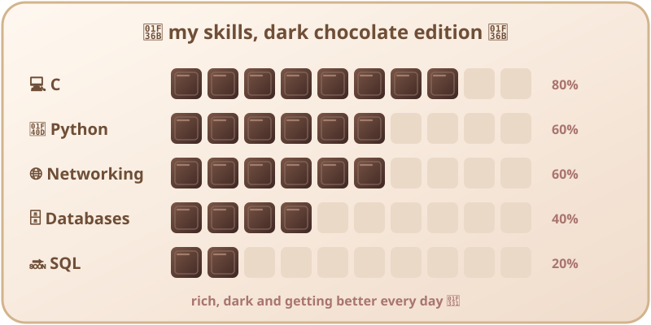
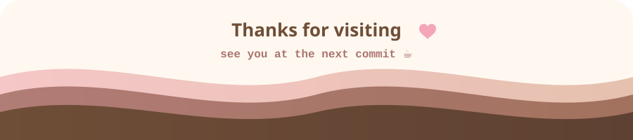

<div align="center">



<br>


</div>

### 🌷 About Me

> Curious by nature and always hunting for the next thing to learn. I am a CS student at UIR, moving step by step from C to Python, from networking to databases, with a cup of coffee never far away. 🤎

```yaml
inas:
  university: "UIR - Computer Science, 2nd year 🎓"
  learning: ["C", "Python", "Networking", "Databases"]
  next_up: "SQL (coming very soon!) 🚀"
  fav_color: "brown 🤎"
  fav_drink: "coffee ☕"
  fav_treat: "dark chocolate 🍫"
  fav_style: "girly🌸"
  superpower: "curiosity"
  motto: "Small steps, cute progress ✨"
```

<div align="center"></div>

### ☕ What I Am Brewing

<div align="center">



<br>



<br>



</div>

<div align="center"></div>

### 🍰 My Coffee Menu

<div align="center">

| Drink | Skill | Flavor notes |
|:---:|:---|:---|
| ☕ **Espresso** | **C** | Strong, direct, the foundation of everything |
| 🍵 **Latte** | **Python** | Smooth, friendly, fun to work with |
| 🧊 **Iced Coffee** | **Networking** | Cool concepts, how machines talk to each other |
| 🍫 **Mocha** | **Databases** | Rich and layered, all about organizing data |
| ✨ **Special of the month** | **SQL** | Brewing... available very soon! |

</div>

### 🌸 My Journey

```mermaid
%%{init: {'theme':'base','themeVariables':{'primaryColor':'#F5DEB3','primaryTextColor':'#6F4E37','primaryBorderColor':'#A9746E','lineColor':'#A9746E','secondaryColor':'#FFF8F0','tertiaryColor':'#FFF8F0'}}}%%
flowchart LR
    A([💻 C]) --> B([🐍 Python])
    B --> C([🌐 Networking])
    C --> D([🗄️ Databases])
    D --> E([🔜 SQL])
    E --> F([✨ What is next?])
    style A fill:#D2B48C,stroke:#6F4E37,color:#3E2723
    style B fill:#C19A6B,stroke:#6F4E37,color:#3E2723
    style C fill:#A9746E,stroke:#6F4E37,color:#FFF8F0
    style D fill:#8B6F5A,stroke:#6F4E37,color:#FFF8F0
    style E fill:#6F4E37,stroke:#3E2723,color:#FFF8F0
    style F fill:#F4C2C2,stroke:#A9746E,color:#6F4E37
```



<div align="center"></div>

### 🧸 Tech Stack

<div align="center">


<br><br>


<br>

**🗣️ Languages**


</div>

### 🐍 My Little Python Corner

<details>
<summary><b>Click to open ☕</b></summary>

```python
# A tiny profile written in Python
class Inas:
    def __init__(self):
        self.color = "brown"
        self.drink = "coffee"
        self.style = "girly"
        self.curious = True

    def learn(self, topic):
        return f"Inas is learning {topic} 🤎"

inas = Inas()
print(inas.learn("SQL"))
```

</details>

### 🔮 Fun Facts

<details>
<summary><b>Click to reveal ✨</b></summary>

- ☕ I probably drink more coffee than I should
- 🤎 Brown is my favorite color and I am not changing it
- 🍫 Dark chocolate and coffee is the perfect combo, no debate
- 🌸 If it is cute, I want it
- 🧠 I get really excited when I learn something new
- 🗣️ I speak 3 languages: French, Arabic and English

</details>

<div align="center"></div>

### 📊 GitHub Stats

<div align="center">


<br>


<br>


</div>

### 🐾 Contribution Snake

<div align="center">


</div>

### 💭 Thought of the Day

<div align="center">


</div>

### 🎀 Beyond the Code

- ☕ **Coffee:** essential for peaceful coding
- 🍫 **Dark chocolate:** coffee's best friend
- 🌸 **vibe:** anything cute gets my vote
- 🤎 **Brown:** my favorite color, obviously
- 🧠 **Curiosity:** always up for learning something new and "wow"

<div align="center">



</div>
